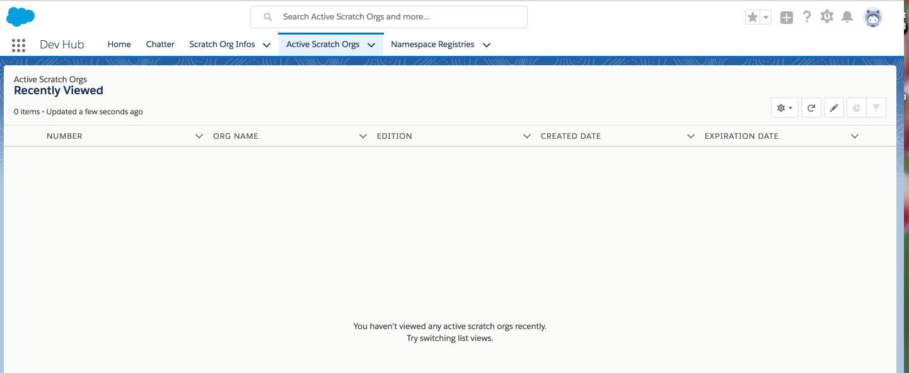

### Salesforce DX

New set of tools 

Helps to streamline the entire development lifecycle


Improves Team Development and Collaboration

Facilitates automated testing and CI

Makes release cycle more efficient and agile


Moves Source of truth to your version control

- Org-based development to artifacts-based development


#### Scratch Org

A dediated, configurable, short-term SF Environment

You can quickly spin-up when starting a new project/feature-branch/feature-test

Disposable

##### Scracth-org config-files

You can configure scratch org with different SF editions with the just the features/preferences you need

You can **share** the scratch org config file with other team members, so that every one in the team have same basic org 


#### Developer Hub (Dev Hub)

Provides you and team ability to create/manage scratch orgs

You do bulk of development work in scartch orgs

Steps:

1. Choose an org to function as your Dev-Hub. You can signup for a [DEV Hub Trial Org](https://developer.salesforce.com/promotions/orgs/dx-signup)
2. This trail org has already Dev-Hub feature enabled. This trial Dev-Hub trial org expire after 30 days
3. Also you can make any **Paid** org as your Dev-Hub org and grant access to the developers

#### CLI

SF CLI is used to control the full application life-cycle and your Force.com apps.

You can easily create environments for :

DEV, TEST
Sync source code between your orgs and source-control


Install CLI 

macOS: [https://sfdc.co/sfdx_cli_osx](https://sfdc.co/sfdx_cli_osx)

Windows-64-bit: [bit	https://sfdc.co/sfdx_cli_win64](bit	https://sfdc.co/sfdx_cli_win64)

2 Check CLI install

```bash
$ sfdx
Usage: sfdx COMMAND [command-specific-options]

Help topics, type "sfdx help TOPIC" for more details:

  sfdx force   # tools for the salesforce developer
  sfdx plugins # manage plugins
  sfdx update  # update sfdx-cli


```

Help in CLI

``` bash
$ sfdx force --help
Usage: sfdx force: [-v] [--json] [--loglevel <string>] [flags]

Flags:
 -v, --version        display the Salesforce API version
 --json               format output as json
 --loglevel LOGLEVEL  logging level for this command invocation
                      (error*,trace,debug,info,warn,fatal)

Usage: sfdx force:COMMAND

Help topics, type sfdx help TOPIC for more details:

 force:alias        manage username aliases
 force:apex         work with Apex code
 force:auth         authorize an org for use with the Salesforce CLI
 force:config       configure the Salesforce CLI
 force:data         manipulate records in your org
 force:doc          display help for force commands
 force:lightning    create and test Lightning component bundles
 force:limits       view your org’s limits
 force:mdapi        retrieve and deploy metadata using Metadata API
 force:org          manage your Salesforce DX orgs
 force:package      install and uninstall first- and second-generation packages
 force:package1     develop first-generation managed and unmanaged packages
 force:package2     develop second-generation packages
 force:project      set up a Salesforce DX project
 force:schema       view standard and custom objects
 force:source       sync your project with your orgs
 force:user         perform user-related admin tasks
 force:visualforce  create and edit Visualforce files
```

Available commands in CLI

```bash

$ sfdx force:doc:commands:list
=== Commands
  force:alias:list                   # list username aliases for the Salesforce CLI
  force:alias:set                    # set username aliases for the Salesforce CLI
  force:apex:class:create            # create an Apex class
  force:apex:execute                 # execute anonymous Apex code
  force:apex:log:get                 # fetch a debug log
  force:apex:log:list                # list debug logs
  force:apex:test:report             # display test results
  force:apex:test:run                # invoke Apex tests
  force:auth:jwt:grant               # authorize an org using the JWT flow
  force:auth:sfdxurl:store           # authorize an org using an SFDX auth URL
  force:auth:web:login               # authorize an org using the web login flow
  force:config:get                   # get config var values for given names
  force:config:list                  # list config vars for the Salesforce CLI
  force:config:set                   # set config vars for the Salesforce CLI
  force:data:bulk:delete             # bulk delete records from a csv file
  force:data:bulk:status             # view the status of a bulk data load job or batch
  force:data:bulk:upsert             # bulk upsert records from a CSV file
  force:data:record:create           # create a record
  force:data:record:delete           # delete a record
  force:data:record:get              # view a record
  force:data:record:update           # update a record
  force:data:soql:query              # execute a SOQL query
  force:data:tree:export             # export data from an org into sObject tree format for force:data:tree:import consumption
  force:data:tree:import             # import data into an org using SObject Tree Save API
  force:doc:commands:display         # display help for force commands
  force:doc:commands:list            # list the force commands
  force:lightning:app:create         # create a Lightning app
  force:lightning:component:create   # create a Lightning component
  force:lightning:event:create       # create a Lightning event
  force:lightning:interface:create   # create a Lightning interface
  force:lightning:lint               # analyse (lint) Lightning component code
  force:lightning:test:create        # create a Lightning test
  force:lightning:test:install       # install Lightning Testing Service unmanaged package in your org
  force:lightning:test:run           # invoke Lightning component tests
  force:limits:api:display           # display current org’s limits
  force:mdapi:convert                # convert Metadata API source into the Salesforce DX source format
  force:mdapi:deploy                 # deploy metadata to an org using Metadata API
  force:mdapi:deploy:report          # check the status of a metadata deployment
  force:mdapi:retrieve               # retrieve metadata from an org using Metadata API
  force:mdapi:retrieve:report        # check the status of a metadata retrieval
  force:org:create                   # create a scratch org
  force:org:delete                   # mark a scratch org for deletion
  force:org:display                  # get org description
  force:org:list                     # list all orgs you’ve created or authenticated to
  force:org:open                     # open an org in your browser
  force:org:shape:create             # create a snapshot of org edition, features, and licenses
  force:org:shape:delete             # delete all org shapes for a target org
  force:org:shape:list               # list all org shapes you’ve created
  force:package1:version:create      # create a first-generation package version in the release org
  force:package1:version:create:get  # retrieve the status of a package version creation request
  force:package1:version:display     # display details about a first-generation package version
  force:package1:version:list        # list package versions for the specified first-generation package or for the org
  force:package2:create              # create a second-generation package
  force:package2:list                # list all second-generation packages in the Dev Hub org
  force:package2:update              # update a second-generation package
  force:package2:version:create      # create a second-generation package version
  force:package2:version:create:get  # retrieve a package version creation request
  force:package2:version:create:list # list package version creation requests
  force:package2:version:get         # retrieve a package version in the Dev Hub org
  force:package2:version:list        # list all package versions in the Dev Hub org
  force:package2:version:update      # update a second-generation package version
  force:package:install              # install a package in the target org
  force:package:install:get          # retrieve the status of a package installation request
  force:package:installed:list       # list the org’s installed packages
  force:package:uninstall            # uninstall a second-generation package from the target org
  force:package:uninstall:get        # retrieve status of package uninstall request
  force:project:create               # create a new SFDX project
  force:project:upgrade              # update project config files to the latest format
  force:schema:sobject:describe      # describe an object
  force:schema:sobject:list          # list all objects of a specified category
  force:source:convert               # convert Salesforce DX source into the Metadata API source format
  force:source:open                  # edit a Lightning Page with Lightning App Builder
  force:source:pull                  # pull source from the scratch org to the project
  force:source:push                  # push source to an org from the project
  force:source:status                # list local changes and/or changes in a scratch org
  force:user:create                  # create a user for a scratch org
  force:user:display                 # displays information about a user of a scratch org
  force:user:list                    # lists all users of a scratch org
  force:user:password:generate       # generate a password for scratch org users
  force:user:permset:assign          # assign a permission set to one or more users of an org
  force:visualforce:component:create # create a Visualforce component
  force:visualforce:page:create      # create a Visualforce page


```

##### Login to Dev-Hub using CLI

After login, you can create scratch orgs

CLI command to login into your orgs:

```bash

 sfdx force:auth:web:login
 
 
```

Help for force:auth:web:login

```
$ sfdx force:auth:web:login --help
Usage: sfdx force:auth:web:login [-i <string>] [-r <url>] [-d] [-s] [-a <string>] [--json] [--loglevel <string>] 

authorize an org using the web login flow

Flags:
 -i, --clientid CLIENTID         OAuth client ID (sometimes called the consumer
                                 key)
 -r, --instanceurl INSTANCEURL   the login URL of the instance the org lives on
 -a, --setalias SETALIAS         set an alias for the authenticated org
 -d, --setdefaultdevhubusername  set the authenticated org as the default dev
                                 hub org for scratch org creation
 -s, --setdefaultusername        set the authenticated org as the default
                                 username that all commands run against
 --json                          format output as json
 --loglevel LOGLEVEL             logging level for this command invocation
                                 (error*,trace,debug,info,warn,fatal)

To log in to a sandbox, set --instanceurl to https://test.salesforce.com.

Examples:
   $ sfdx force:auth:web:login -a TestOrg1
   $ sfdx force:auth:web:login -i <OAuth client id>
   $ sfdx force:auth:web:login -r https://test.salesforce.com
   
```
 
##### Authorize an org to act as default Dev-Hub

```
sfdx force:auth:web:login -d -a DevHub

```

This command will take you to login page.  Login with our credentials.

You can close the Dev Hub and still create scratch orgs.

To open the Dev Hub org to look at active scratch orgs or your namespace registry:

``` bash

$ sfdx force:org:open -u DevHub
Access org 00D1I000001UmBpUAK as user mohan.chinnappan.n_devhub@gmail.com with the following URL: https://na73.salesforce.com/secur/frontdoor.jsp?sid=00D1I000001UmBp!ARIAQEPDh0rRd2521ZQEu8ksiw20vVWSSn9ePyAtbfdS3SoqL9VgpAWC0cnLS8HIsAVnhvCupBJnOMOU.gwJICFDXeIqqSAE

```




Using alias names (for instanceurls), examples:

```
sfdx force:auth:web:login -r https://test.salesforce.com -a FullSandbox

sfdx force:auth:web:login -r https://test.salesforce.com -a DevSandbox

# note: -r is instanceurl
```

force:org:open help

```
Usage: sfdx force:org:open [-p <string>] [-r] [-u <string>] [--json] [--loglevel <string>] 

open an org in your browser

Flags:
 -p, --path PATH                      navigation URL path
 -u, --targetusername TARGETUSERNAME  username or alais for the target org;
                                      overrides default target org
 -r, --urlonly                        display navigation URL, but don’t launch
                                      browser
 --json                               format output as json
 --loglevel LOGLEVEL                  logging level for this command invocation
                                      (error*,trace,debug,info,warn,fatal)

Opens your default scratch org, or another org that you specify.

To open a specific page, specify the portion of the URL after "yourInstance.salesforce.com/" as --path. 
For example, specify "--path one/one.app" to open Lightning Experience, or specify "--path /apex/YourPage" to open a Visualforce page.

To generate a URL but not launch your browser, specify --urlonly.

Examples:
  $ sfdx force:org:open
  $ sfdx force:org:open -u me@my.org
  $ sfdx force:org:open -u MyTestOrg1
  $ sfdx force:org:open -r -p one/one.app

```

Listing orgs you have logged-in:

```
 

$ sfdx force:org:list
=== Orgs
     ALIAS   USERNAME                             ORG ID              CONNECTED STATUS
───  ──────  ───────────────────────────────────  ──────────────────  ────────────────
             uname1@mail.com       00Df40000003eOAEAY  Connected
             uname2@mail.com       00Df4000000nUtnEAE  Connected  
(D)  DevHub  uname_devhb@mail.com  00D1I000001UmBpUAK  Connected


No active scratch orgs found. Specify --all to see all scratch orgs


```


##### References:

1. [Trailhead Setup SFDX](https://trailhead.salesforce.com/en/modules/sfdx_app_dev/units/sfdx_app_dev_setup_dx)::


